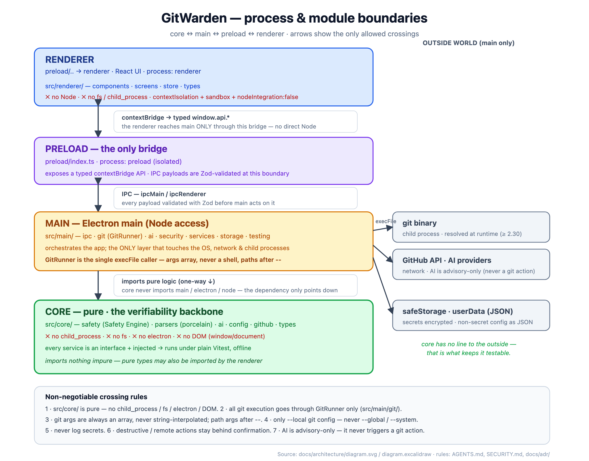

# GitWarden — architecture at a glance

One diagram of the process & module boundaries: **core ↔ main ↔ preload ↔ renderer** and the only
crossings allowed between them. Start here when the layering is unclear.



- **Editable source:** [`diagram.excalidraw`](diagram.excalidraw) — open at
  [excalidraw.com](https://excalidraw.com) (File → Open) to edit.
- **Vector:** [`diagram.svg`](diagram.svg) — the source the PNG is rendered from.
- **Regenerate the PNG** after editing the SVG (uses the repo's bundled Chromium, offline; run from
  the repo root):
  ```bash
  node -e "import('playwright').then(async({chromium})=>{const fs=require('fs');const svg=fs.readFileSync('docs/architecture/diagram.svg','utf8');const b=await chromium.launch();const c=await b.newContext({viewport:{width:1200,height:940},deviceScaleFactor:2});const p=await c.newPage();await p.setContent('<body style=\"margin:0;background:#fff\">'+svg+'</body>',{waitUntil:'networkidle'});await (await p.\$('svg')).screenshot({path:'docs/architecture/diagram.png'});await b.close();})"
  ```

## The layers

| Layer        | Path               | Process  | May touch                                            |
| ------------ | ------------------ | -------- | ---------------------------------------------------- |
| **Renderer** | `src/renderer/`    | renderer | only `window.api.*` (the preload bridge) — no Node   |
| **Preload**  | `preload/index.ts` | preload  | the typed `contextBridge`; Zod-validates IPC         |
| **Main**     | `src/main/`        | main     | OS, network, child processes, secrets, the core      |
| **Core**     | `src/core/`        | (pure)   | nothing impure — pure logic, runs under plain Vitest |

The crossing rules (pure core, `GitRunner`-only `execFile`, args-as-array, `--local`-only, never log
secrets, confirm destructive/remote actions, advisory-only AI) are the same non-negotiables in
[`AGENTS.md`](../../AGENTS.md), [`SECURITY.md`](../../SECURITY.md), and the ADRs under
[`docs/adr/`](../adr/). The visual point: **core has no edge to the outside world** — that is what
keeps it testable.
